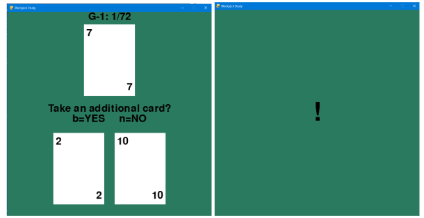

# Decision Field Theory Under Time Pressure
Author: Mason Smith

Email: mosmith3@asu.edu

# Introduction
Decision field theory (DFT) is a model of cognitive decision-making that predicts expected choice probability and response time of human decisions. 
DFT belongs to a class of _sequential sampling models_ that tpyically produce estimates of how long a decision will take to make.
However, DFT was specifically formulated to consider decisions under risk and uncertainty. 
This project applies DFT in risky decision task under time pressure.
Adapted from the study in [1], we designed a cognitive study that prompts participants to make decisions under varying levels of time pressure in a modified blackjack game.
Also, the provided library includes an implementation of DFT that fits the model to the decision data collected using the data collection platform.

# Experimental Design
A simplified version of blackjack will be used to generate risky decisions. The goal in this game is to maximize
the sum of your cards without going over 21 such that your cards exceed the dealer’s. We remove all face cards
(jack, queen, king, and joker) as well as the ace to avoid ambiguity. Players are not allowed to split or take any
other actions besides ”hit” or ”stay.” Therefore, each player is faced with a binomial decision during every trial. On
each participant trial, they will receive two cards shown on the bottom of the screen and the computer (dealer) will
receive one card shown on the top of the screen. Participants are instructed to assume that the computer (dealer)
draws additional cards after the participant makes their decision. Also, participants are told that they will not see
the additional cards they receive after their decision, the additional cards the computer (dealer) draws, or who won
each hand. This was done to not change participant decision strategies throughout the game. An example of the
interface presented to participants can be found in Fig. 1. We will manipulate player decision strategies in a 4x3x3
factorial design described in the next sections. Player choice probabilities and response times will then be observed
as dependent variables in response to these manipulations.

Figure 1. Data Collection Platform

## Factor 1: Risk Level
- Level 1 - Low Risk Level (Low RL): This level describes trials where player cards sum to 12 or 13.
- Level 2 - Medium Risk Level (Med RL): This level describes trials where player cards sum to 14 or 15.
- Level 3 - High Risk Level (High RL): This level describes trials where player cards sum to 16 or 17.
- Level 4 - Most Risk (Most RL): This level describes trials where player cards sum to 18 or 19.
## Factor 2: Computer Hand
- Level 1 - Low Computer Hand (Low CH): At this level, the dealer is dealt a 2, 3, or 4.
- Level 2 - Medium Computer Hand (Med CH): At this level, the dealer is dealt a 5, 6, or 7.
- Level 3 - High Computer Hand (Med CH): At this level, the dealer is dealt an 8, 9, or 10.
## Factor 3: Time Pressure
- Level 1 - Low Time Pressure (Low TP): Participants are instructed to ”make your decision to take
another card or not within 5 seconds”
- Level 2 - Medium Time Pressure (Med TP): Participants are instructed to ”make your decision to take
another card or not within 4 seconds”
- Level 3 - Medium Time Pressure (High TP): Participants are instructed to ”make your decision to take
another card or not within 3 seconds”

# Procedure
Trials are created to ensure that all possible combinations of player (N = 8 possible sums from 12 to 19) and dealer
cards (N = 9 cards from 2 to 10) are presented in random order. Combinations of player cards that equal a possible
sum were randomly sampled from possible combinations (e.g., for a sum of 14, 4 and 10 as well as 6 and 8 are equally
likely). This results in N = 72 trials spanning the possible combination of cards presented. After each trial, a blank
screen will appear for 350ms followed by an exclamation mark indicating that their decision was recorded. If the
participant does not does not make the decision in the alloted time, they will see a red ”X” and that decision will
be appended to the end of the current trial. Participants can then press the ”spacebar” to advance to the next trial
where they respond to ”Take an additional card?” by pressing the ”b” key labeled ”yes” or pressing the ”n” key
labeled ”no”. All 72 trials were repeated over three experimental blocks (time pressures) for a total of N = 216
decisions in this experiment. Order of the experimental blocks will be randomized to mitigate order effects influencing
the results of analysis.
Before the experiment begins, instructions describing the simplified blackjack game is given. After the instructions,
participants are given three practice trials. Participants are encouraged to ask questions at any time. Data collected
from participants will consist of 1) their choice (hit/stay) of each trial and 2) their response time to their decision.
Also, basic demographic information (age and sex) will be collected before the experiment.
4

# Code Overview
- _/environment/..._
  - Provides packages for the data collection platform.
  - run "_/environment/interface.py_" to start the blackjack game
- "/dist/"
  - Provides an executable version of the data collection platform
  - run "/dist/interface.exe" to start the experiment
-  "/data/"
    - Data is automatically collected here when the experiment is complete
    - "/data/data_utils.py" provides various data managment packages
- "/analysis/"
  - Provides several analysis utilities
  - "/analysis/ANOVA.py" takes the collected data and runs a three-way ANOVA analysis for choice probabilities and response times for both the observed data and predicted values from DFT

# References
[1] I. E. Dror, B. Basola, and J. R. Busemeyer, “Decision making under time pressure: An independent test of
sequential sampling models,” Memory & cognition, vol. 27, no. 4, pp. 713–725, 1999.